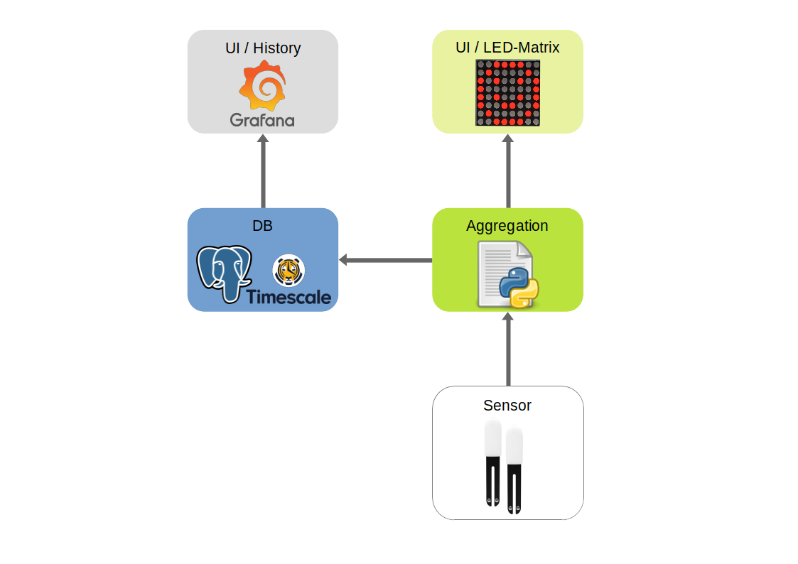
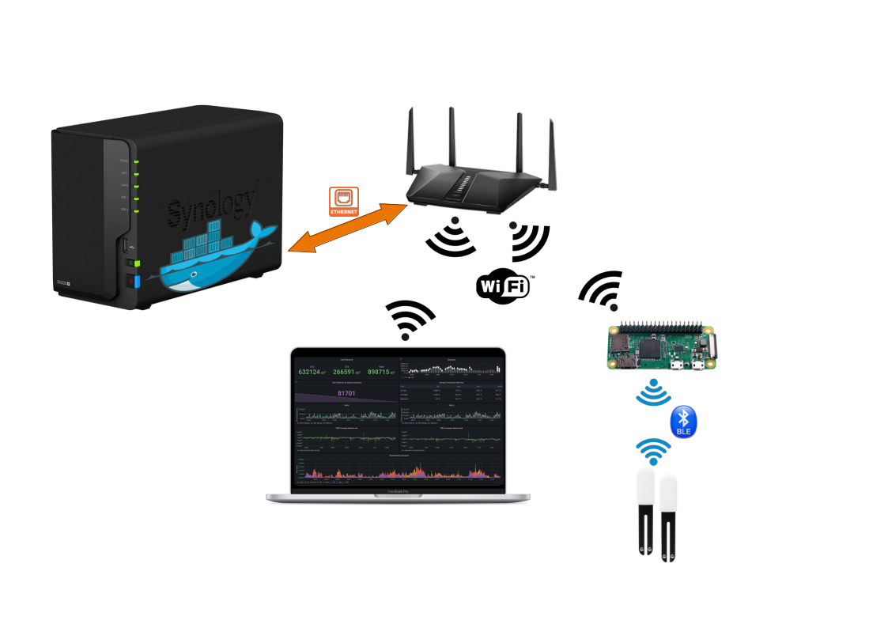

# PlantBuddy

Buddy that helps you out with your plants 🌱🪴

## General Konzept

We will use some stock plant sensors from Xiomi. They are also sold with different brands and sometimes cheaper as well. We will read the data from the Sensors with an raspberry pi and send the Data to an PostgreSQL Database. Afterwords the data will be visualized with Grafana. In my example i will use an Synology NAS with an Docker Engine to host the Database and Grafana.



## Communication



# Database

## Set up the Docker Container
In my example i used the official Docker Container form docker-hub. To create the container i used Portainer to build a stack for the Visualization and the Database. Here is the part for the 

```yaml
version: '3.1'

services:

  #timescale DB
  timescaledb:
    image: timescale/timescaledb:latest-pg14
    restart: always
    ports:
      - 5444:5432
    environment:
      POSTGRES_USER: YOUR_USER_NAME
      POSTGRES_PASSWORD: YOUR_SUPER_SECURE_PASSWORD
      POSTGRES_DB: homedb
      PGDATA: /var/lib/postgresql/data/pgdata
    volumes:
      - /volume1/docker/postgresql:/var/lib/postgresql/data
  
```

## Configure the Database

After creating the database connect to the database and make those SQL Statements to create all needed Tables and Hypertables. I used the offical TimeScaleDB website to get those commands and transformed them to our needs. [TimeScaleDB](https://legacy-docs.timescale.com/v1.7/tutorials/quickstart-python)

```sql

/* Create the Relationable Table https://docs.timescale.com/timescaledb/latest/quick-start/python/#create-a-relational-table */
CREATE TABLE plants (id SERIAL PRIMARY KEY, type VARCHAR(50), location VARCHAR(50));

/* Create the Hypertable https://docs.timescale.com/timescaledb/latest/quick-start/python/#create-hypertable */
CREATE TABLE sensor_data ( time TIMESTAMPTZ NOT NULL, sensor_id INTEGER, sensor_name VARCHAR(50), light_intensity DOUBLE PRECISION, air_temperature DOUBLE PRECISION, soil_moisture DOUBLE PRECISION, soil_conductivity DOUBLE PRECISION, battery_level DOUBLE PRECISION, FOREIGN KEY (sensor_id) REFERENCES plants (id));

/* Select the created Hypertable */
SELECT create_hypertable('sensor_data', 'time');

```


New Tables: for the better data handling
```sql
/* Create the Relationable Table https://docs.timescale.com/timescaledb/latest/quick-start/python/#create-a-relational-table */
CREATE TABLE home (id SERIAL PRIMARY KEY, type VARCHAR(50), location VARCHAR(50));

/* Create the Hypertable https://docs.timescale.com/timescaledb/latest/quick-start/python/#create-hypertable */
CREATE TABLE sensor ( time TIMESTAMPTZ NOT NULL, sensor_id INTEGER, sensor_name VARCHAR(50), sensor_data JSON, FOREIGN KEY (sensor_id) REFERENCES home (id));

/* Select the created Hypertable */
SELECT create_hypertable('sensor', 'time');

```

# Visualization

To Visualize 

```yaml
version: '3.1'

services: 

  #Install grafaana on port 3018
  #Default username: admin
  #Default password: admin
  grafana:
    image: grafana/grafana:latest
    restart: always
    ports:
      - 3018:3000
    volumes:
      - /volume1/docker/grafana:/var/lib/grafana
```

# Data aggregation

Data will be read from the Xiaomi Plant Sensor.

## Required Software

To install PostgresSQL on MacOS with brew use:

```sh
brew install postgresql@14
```

To install PostgresSql on the Raspberry Pi use:

```sh
sudo apt install postgresql
```


# Pi Konfiguration

After installing the latest Raspbian OS from RaspberryPi.org update the systenm by:

sudo apt-get update
> 
>$ sudo apt-get upgrade

## Install the requested libraries

>$ pip install fritzconnection adafruit-circuitpython-mcp4725 netifaces


## Create and start service

Source: https://www.nerdynat.com/programming/2019/run-python-on-your-raspberry-pi-as-background-service/

```sh
sudo nano /lib/systemd/system/PlantBuddy.service
```

Add the text from ./Software/PlantBuddy.service
Than change the permission

```sh
sudo chmod 644 /lib/systemd/system/PlantBuddy.service
```

Reload the system manager configuration

```sh
sudo systemctl daemon-reload
```

Start the Service

```sh
sudo systemctl start PlantBuddy.service
```


Enable the service to start at boot 

```sh
sudo systemctl enable PlantBuddy.service
```

So stop the service you can use

```sh
sudo systemctl stop PlantBuddy.service
```


## Hardware

- Raspberry Pi zero [shop]()
- Capacitive moisture sensor [shop](https://www.reichelt.de/entwicklerboards-feuchtesensor-bodenfeuchte--debo-cap-sens-p223620.html?&nbc=1)
- 8x8 Bicolor LED matrix [shop](https://www.reichelt.de/entwicklerboards-zweifarbige-led-matrix-debo-led-matrix-p235472.html?&nbc=1)
- BH1750 Digital light sensor [shop](https://www.reichelt.de/entwicklerboards-digitaler-lichtsensor-bh1750-debo-bh-1750-p224217.html?&nbc=1)


### Distance sensor

In order to dedect presence we will use the ultrasonic sensor.
Here is a tutorial from the net:
https://tutorials-raspberrypi.de/entfernung-messen-mit-ultraschallsensor-hc-sr04/


### LED Matrix

The used LED Matrix is from Adafruit: https://www.adafruit.com/product/902
It is an 8x8 Bi Color LED Matrix. So you can display three colors red, yellow and green.

The Adafruit implementation for python causes slow response for the matrix. You are only able to set pixel by pixel.
In order to improve the performance we use this Library to control the LED-Matrix. The ht16k33.py and the ht16k33matrixcolour.py Files are needed in order to function properly.

https://github.com/smittytone/HT16K33-Python

With this Library we also need the blinka library from Adafruit. To install the Library you can use pip.

> sudo pip3 install adafruit-blinka


### Light sensor

The Fritzing file was downloaded here:
http://omnigatherum.ca/wp/?p=338

Library found here: [Link](https://gist.github.com/oskar456/95c66d564c58361ecf9f)

Will be used with the SMBUS Library

> pip3 install smbus


### Temp Humidity Sensor

Using the DHT Library

Some Infos from websites
- [Link1](https://www.pi-shop.ch/temperatur-und-feuchtigkeitssensor)
- [Link2](https://learn.adafruit.com/dht/using-a-dhtxx-sensor)

Used library is from Adafruit: https://github.com/adafruit/Adafruit_CircuitPython_DHT


To Install the library use pip:

> pip3 install adafruit-circuitpython-dht

## Software

The Software is written in Python. 

In order to control the devices you need to enable the I2C Interface on the Raspberry Pi.

### Install Dependencies


